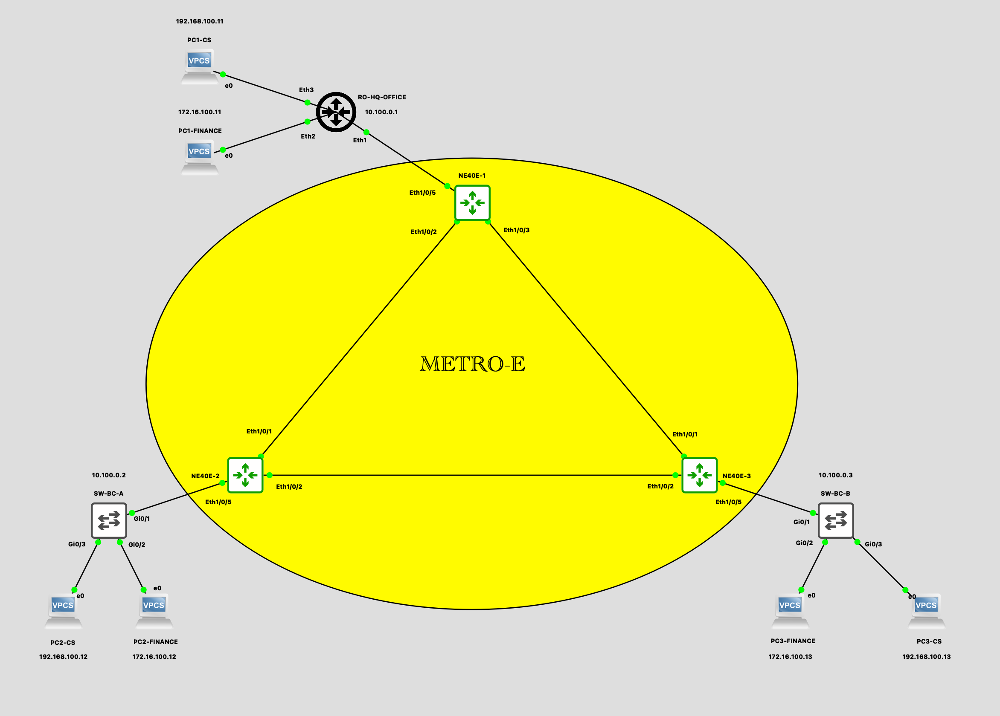
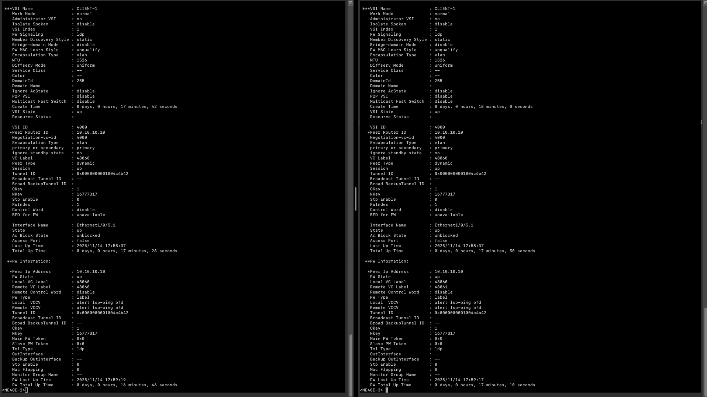

# Huawei NE MPLS VSI
This repository contains configuration examples for **L2VPN Q-in-Q using VSI on Huawei NE devices** in a Metro-E environment.  
The scenario simulates a Metro-E service used by a company to connect **two branch offices** to the **Headquarters (HQ)**.

---

## Topology

---

## Metro-E Status

---

### 1. MPLS & QnQ status

---

### 2. VSI status

---

## Client test
At the HQ office, a router is used. Since the Metro-E service supports **Q-in-Q (allowing up to 5 VLANs)**, the branch offices only require an L2 switch with a trunk connection to the Metro-E.

The trunk carries the following VLANs:

- **Switch management VLAN (for remote access to the branch switch)**
- **CS network VLAN**
- **Finance network VLAN**

---

## 1. Remote Access to Branch Switch from HQ Router

---

## 2. Testing the CS network

---

## 3. Testing the Finance network

---

## Devices

- **Metro-E**: NE40E version V800R011C00SPC607B607
- **HQ Router**: MikroTik RouterOS 7.14.3
- **Switch Branch**: Cisco IOS Software, vios_l2 Software (vios_l2-ADVENTERPRISEK9-M)

---

## Links

Origin : 
<https://github.com/andre4freelance/Huawei-NE-MPLS-VSI>

Linkedin post : 
<https://www.linkedin.com/posts/link-andre-bastian_networking-qinq-vsi-activity-7395251258040877056-G2xI?utm_source=share&utm_medium=member_desktop&rcm=ACoAAD73JlUBty-p-mBfMEW0-O4j0sv-e_PRQvc>

Reference : 
<https://support.huawei.com/enterprise/en/doc/EDOC1100278545/f9e754c6/EN-US_TASK_0172363295>

